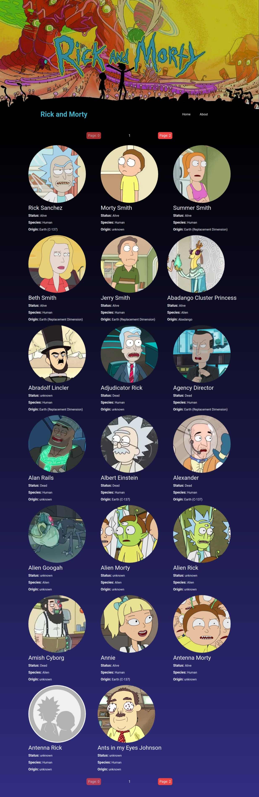

# Rick and Morty Web Page

---
This project was made using:

* React
* Vite
* TailwindCSS
* Rick and Morty [API](https://rickandmortyapi.com/)

and following the [Fazt Code tutorial](https://www.youtube.com/watch?v=H1aNTRK3YfU) as guide.

